# 🛍️ Stage d’initiation – Application E-commerce Cosmétique

## 📌 Présentation
Ce projet a été réalisé dans le cadre d’un **stage d’initiation**.
Il s’agit d’une application web de **vente de produits cosmétiques** permettant
aux utilisateurs de consulter les produits et d’effectuer des réservations,
ainsi qu’à l’administrateur de gérer le contenu.

---

## 🎯 Objectifs du stage
- Découvrir le développement d’une application web
- Comprendre le rôle du frontend et du backend
- Manipuler une base de données
- Découvrir la gestion des produits et des utilisateurs

---

## 🧱 Architecture du projet
- **Frontend** : Interface utilisateur
- **Backend** : Spring Boot (API REST)
- **Admin** : Interface d’administration

---

# 🚀 Démo de l’application

## 🖥️ Partie Frontend (Utilisateur)

### 🏠 Page d’accueil
Affichage général de l’application et accès aux fonctionnalités principales.


---

### 🔐 Page de connexion
Authentification de l’utilisateur.

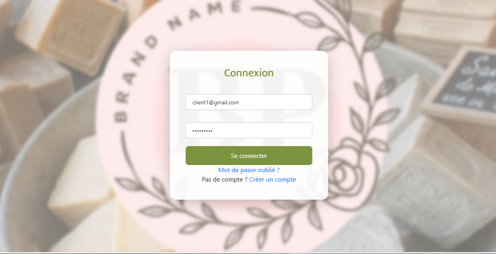

---

### 🧴 Page des produits
Consultation de la liste des produits cosmétiques.

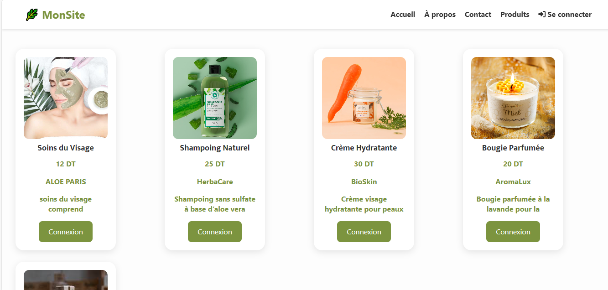

---

### 🛒 Réservation
Ajout d’un produit et validation de la réservation.

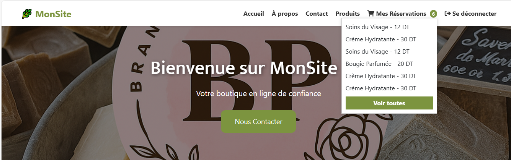

---

### ✅ Confirmation de réservation
Affichage de la confirmation après validation.

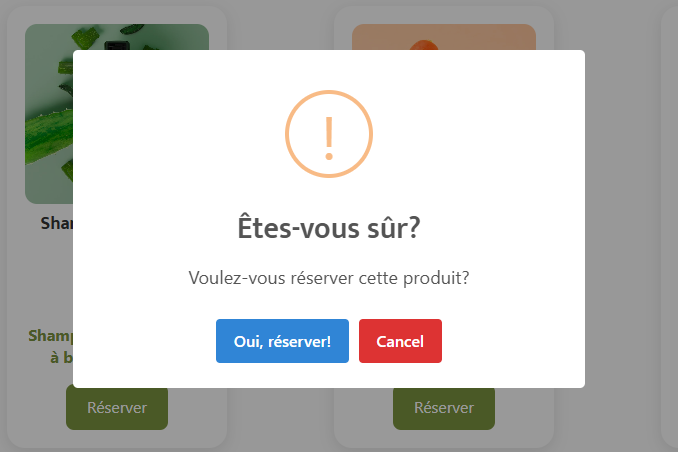

---

### 📩 Page Contact
Envoi d’un message à l’administrateur.

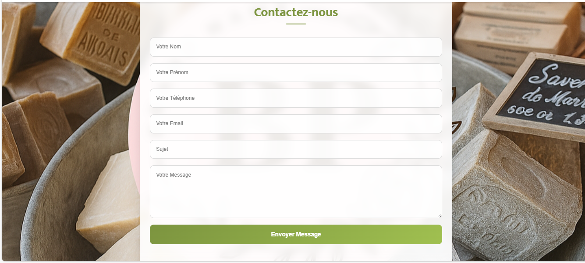

---

## 🛠️ Partie Admin (Administration)

### 🔐 Connexion Admin
Accès sécurisé à l’espace administrateur.

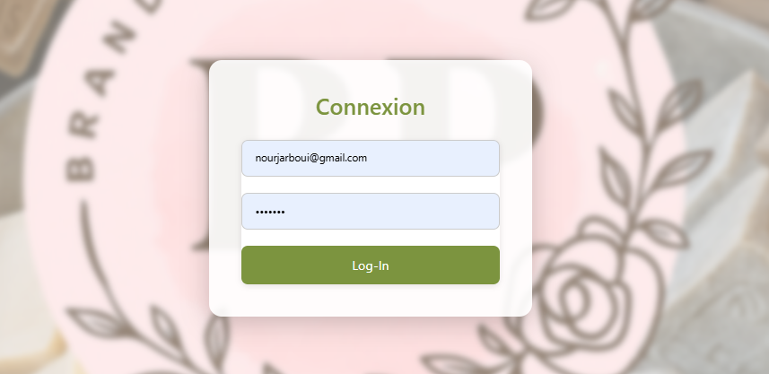

---

### 📊 Tableau de bord Admin
Vue générale de gestion.

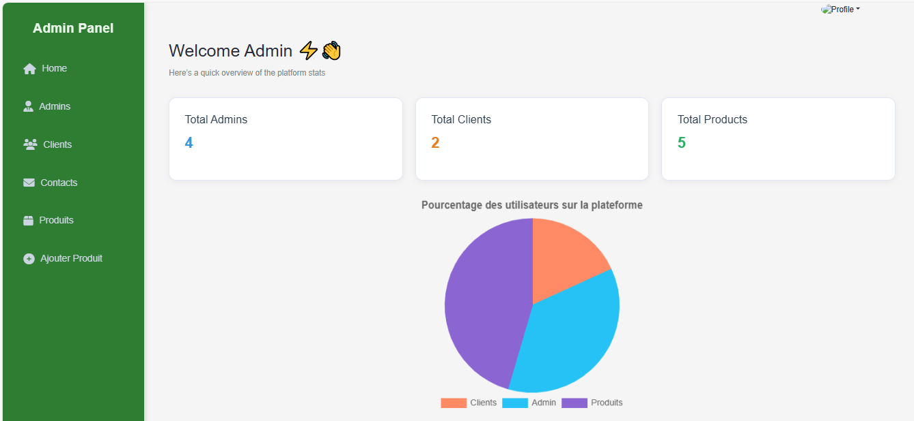

---

### ➕ Ajouter un produit
Ajout d’un nouveau produit cosmétique.

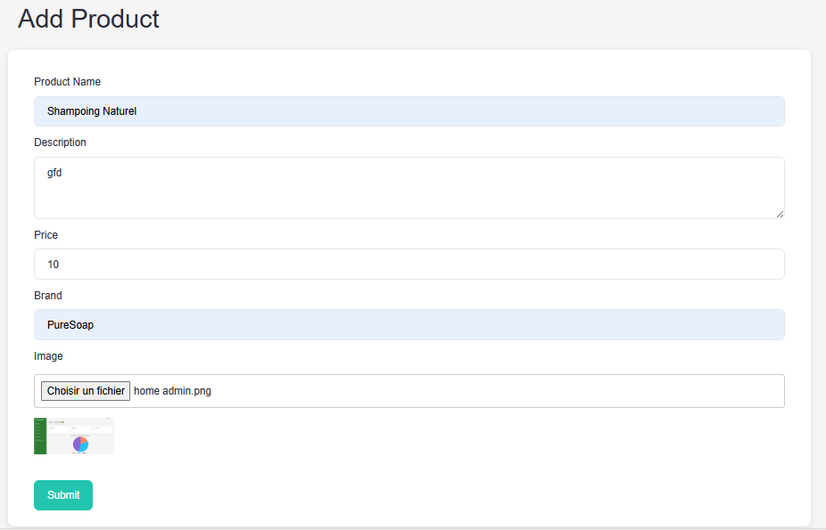

---

### 📋 Liste des produits
Affichage et gestion des produits.

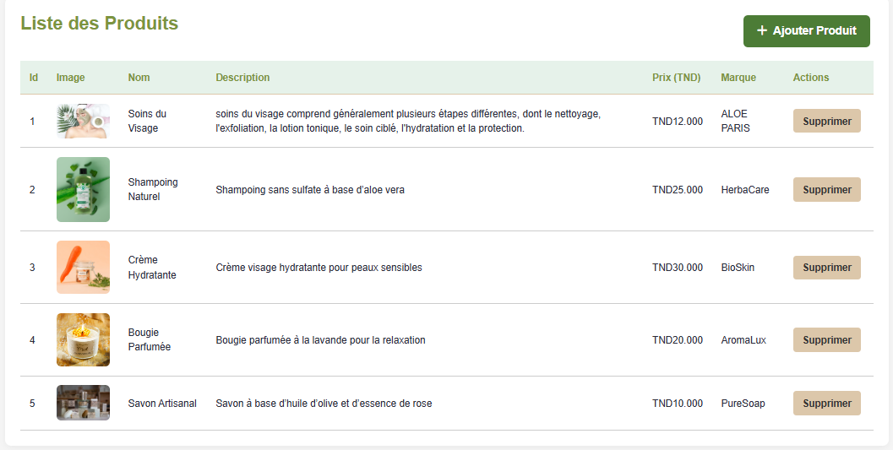

---

### ❌ Suppression d’un produit
Suppression d’un produit existant.

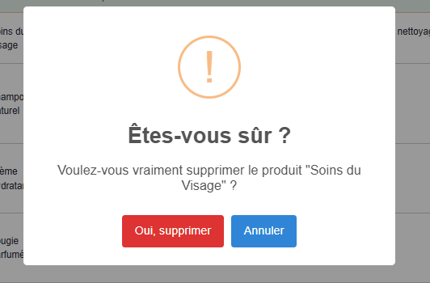

---

### ✏️ Mise à jour Admin
Modification des informations administrateur.

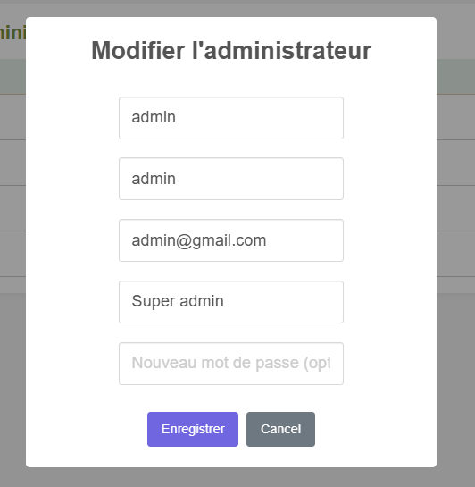

---

### ✅ Validation de mise à jour
Confirmation de la modification.

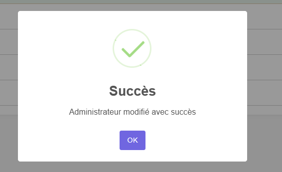

---

## 🧪 Démarche de démonstration (Stage d’initiation)
1. Accéder à la page d’accueil
2. Se connecter en tant qu’utilisateur
3. Consulter les produits
4. Effectuer une réservation
5. Confirmer la réservation
6. Accéder à l’espace administrateur
7. Gérer les produits

---

## ⚙️ Lancement du projet
```bash
# Backend
cd stage
mvn spring-boot:run

# Frontend
cd Frontend
npm start
## 👩‍🎓 Réalisé par
- Nom : Nour Houda  Jarboui 
- Type de stage : Stage d’initiation  
- Domaine : Développement Web  
- Année : 2025
